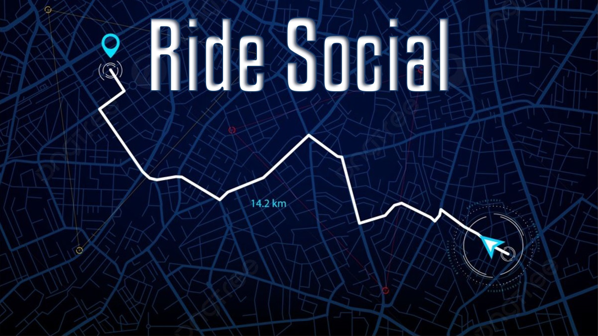

# Einführung in Ride Social
(Kappelmayer Dominic)  
  
Mit "Ride Social" soll ein Projekt ins Leben gerufen werden, das für begeisterte Motorrad- und Autofahrer*innen eine Plattform bietet.  
Obwohl es in der heutigen Zeit so einfach ist, soziale Kontakte zu knüpfen, ist die Suche nach einer Gruppe, die das gleiche Hobby teilt, nicht einfach.  
Selbst in großen Social-Media-Apps ist es als Neuling schwierig, sich in bereits gefestigte Gruppen oder Freundeskreise zu integrieren. 
   
Ein Augenmerk dieses Projekts ist es, einerseits, neue Bekanntschaften kennenzulernen und andererseits, den Spaß an seinem Hobby mit anderen ausleben zu können.  
Diesen Zugang wird die App den Usern immens erleichtern, denn wir bieten die Möglichkeit, sich spontan, für eine bestimmte Uhrzeit oder an einen bestimmten Tag zu verabreden.  
Die Gruppengröße wird individuell vom User gewählt, um marktdominierende Apps einen Schritt voraus zu sein. Die Vielfalt der Individualität in der App ist von großer Bedeutung.  
Ebenso spielt der Fahrstil des Users eine entscheidende Rolle, dieser kann angeben, wie er zum Beispiel heute fahren möchte, ob kurvig oder ein kleiner Städtetrip oder auch nur
eine Abendrunde im kleinen Stil.  
Es kann ein Zeitraum gewählt werden, in dem die gewählte Route für die gesamte Gruppe abgeschlossen ist oder auch aufgrund einer präzisen Zeitvorgabe wird eine passende Route berechnet.  

# Inhaltsverzeichnis:
## 1. [Ausgangssituation](/Workspace/InitialSituation.md)
## 2. [Allgemeine Bedingungen und Beschränkungen](/Workspace/ConditionsAndConstraints.md)
## 3. [System Konzept und Ziele](/Workspace/ConceptAndObjectives.md)
## 4. [Möglichkeiten und Risiken](/Workspace/OpportunitiesAndRisks.md)
## 5. [Planung](/Workspace/Planning.md)
